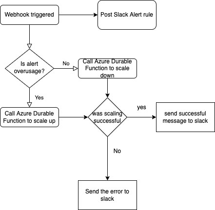

# Azure Elastic SQL pool Auto Scaling

This repository implements Autoscaling of Azure Elastic SQL pool using the structure defined [here](https://medium.com/@abhirup.guha/azure-sql-elastic-pool-auto-scaling-using-logic-app-azure-functions-durable-functions-4239710cff05) 

The implementation contains three sections
- Alert rules
- Azure Logic App
- Azure Durable Functions

## Alert Rules

This solution contains two alert rules which have been set for SQL Elastic Pool 
1. High Usage trigger  
    condition: Whenever the maximum dtu percentage is greater than 50%  
    Alert rule name: DTU percentage of peekage-elastic-sql is high  
    action group name: ScaleElasticSQLLogicAppTrigger 
2. Low Usage Trigger  
    condition: Whenever the maximum dtu percentage is less than or equal to 35% (and) Whenever the maximum edtu limit is greater than 100  
    Alert rule name: DTU percentage of peekage-elastic-sql is too low  
    action group name: ScaleElasticSQLLogicAppTrigger  

The action group is set to Azure logic app webhook.
## Azure Logic app

The Logic triggerd by webhook and if the alert rule name contains high the scaling set to `up` and if the alert rule name contains low the scaling variable set to `down` and it posts the scaling variable to the slack. Furthermore, it call Azure durable function Orchestrator with vairable `scaling` and after completion of the function. it will post its output to the slack channel.

### Parameters

        "workflows_sql_elastic_scale_logic_app_name":  <the logic app name>
        "connections_slack_1_externalid": <the slack connection id>
        "durable_function_orchestrator_uri": <the http link of durable function orchestrator>
        "subscription_id":  <subscription id of logic app name>
        "slack_channel_id":  <the id of slack channel>
        

## Azure Durable Functions
As in the Azure documents you can use a [script](https://docs.microsoft.com/en-us/azure/azure-sql/database/scripts/monitor-and-scale-pool-powershell) to scale and change attributes of SQL Elastic pool. To automate this process you can use Azure Functions to run script whenever you need. As mentioned [here](https://medium.com/@abhirup.guha/azure-sql-elastic-pool-auto-scaling-using-logic-app-azure-functions-durable-functions-4239710cff05) the scale request and changing SQL Elastic Pool attributes may takes more than two minutes and the Wehook call of Azure functions/Webhooks in Azure Logic Apps timeouts after two minutes. So, we need to call the scale request asynchronously using Azure Durale Functions. 

The Azure Durable Function has three parts: Starter,Orchestrator, and the Activity Function. For more information check out the [documentation](https://docs.microsoft.com/en-us/azure/azure-functions/durable/durable-functions-overview?tabs=csharp).

I used Powershell environment for my Activity Function [`SQLPoolScale`](./DurableFunction/SQLPoolScale/run.ps1)
in this function first we login to the Az through Az-connect you can create a service principal and grant contributor to the SQL Pool and SQL server. The next step we get the real-time dtu of the SQL pool, and based on the defined `SCALE_MARGIN`, the dtu range (`MIN_DTU_RANGE`, `MAX_DTU_RANGE`), and the passing parameter `scaling`(up or down). we choose the right `standardEditionDtu`. Just be caution that the eDTU of SQL POOl has [limited values](https://docs.microsoft.com/en-us/azure/azure-sql/database/resource-limits-dtu-elastic-pools) (50,100,200,300,400,800,1200,1600,2000,2500,3000) so you should choose the RANGE values wisely.

### variables

    "AzureWebJobsStorage": "<Azure storage Connection String>",
    "FUNCTIONS_WORKER_RUNTIME": "powershell",
    "FUNCTIONS_WORKER_RUNTIME_VERSION": "~7",
    "SQL_ELASTIC_SCALE_SP_ID": "<service principal id of elastic access>",
    "SQL_ELASTIC_SCALE_SP_PASS": "<service principal password of elastic access>",
    "TENANT_ID":"<tenant id of elastic sql pool>",
    "SQL_POOL_SUBSCRIPTION_ID":"<subscription id of elastic sql pool>",
    "SQL_POOL_RESOURCE_GROUP_NAME":"<resource group of elastic sql pool>",
    "SQL_POOL_LOCATION":"<location of elastic sql pool>",
    "SQL_POOL_NAME":"<elastic sql pool name>",
    "SQL_SERVER_NAME":"<server name of elastic sql pool>",
    "SCALE_MARGIN":"#margin of the real dtu",
    "MAX_DTU_RANGE":"#max range of dtu",
    "MIN_DTU_RANGE":"#min range of dtu"